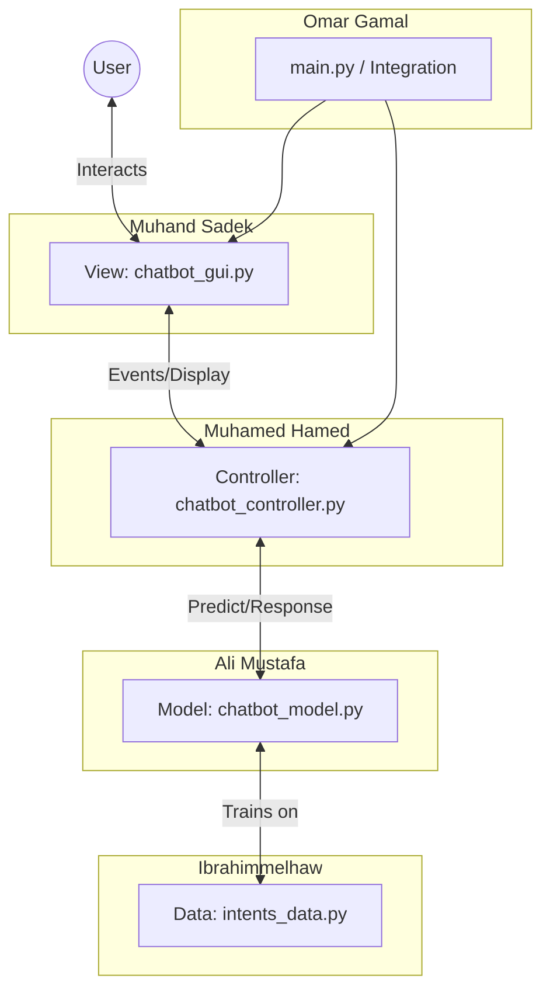

# Project Team Roles & Responsibilities

Based on the current structure of the `nlp_chatbot_project`, here is the updated division of labor for the 5 team members.

## Team Members
1. Omar Gamal
2. Muhand Sadek
3. Ali Mustafa
4. Muhamed Hamed
5. Ibrahimmelhaw

## 1. Omar Gamal - Project Lead & Integration
**Focus Area**: System Architecture, Entry Point, Testing
**Files**: `main.py`, `requirements.txt`, `README.md`
**Responsibilities**:
- Coordinating the overall integration of modules in `main.py`.
- Managing dependencies in `requirements.txt`.
- Ensuring the `README.md` is up to date with setup instructions.
- Conducting final integration testing to ensure the View, Controller, and Model talk to each other correctly.
- Code reviews and merging changes.

## 2. Muhand Sadek - Frontend Developer (GUI)
**Focus Area**: User Interface
**Files**: `view/chatbot_gui.py`
**Responsibilities**:
- Designing and implementing the Chatbot GUI.
- Ensuring a responsive and user-friendly design.
- Handling user input events and displaying bot responses.
- Visual improvements (colors, fonts, layout).

## 3. Ali Mustafa - AI/ML Specialist
**Focus Area**: Machine Learning Model
**Files**: `models/chatbot_model.py`
**Responsibilities**:
- Developing and refining the Natural Language Processing (NLP) model.
- Implementing the training logic (loading data, preprocessing, training neural net).
- Optimizing model accuracy and saving the trained model.
- Ensuring the model can predict intents effectively from user input.

## 4. Muhamed Hamed - Backend Logic / Controller
**Focus Area**: Application Logic
**Files**: `controller/chatbot_controller.py`
**Responsibilities**:
- Acting as the bridge between the GUI and the Model.
- Processing user messages received from the View before sending to the Model.
- Formatting the Model's response before sending it back to the View.
- Handling any auxiliary logic (e.g., fallback responses, error handling).

## 5. Ibrahimmelhaw - Data Engineer
**Focus Area**: Data & Knowledge Base
**Files**: `data/intents_data.py`
**Responsibilities**:
- Curating and expanding the dataset of intents, patterns, and responses.
- Structuring the training data JSON/Python dictionary.
- Ensuring data quality and diversity for better model training.

---
## Workflow Diagram

